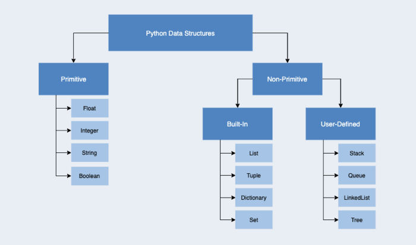

# beginners-py-learn
An attempt to teach python to beginners with examples.

# Any one of these IDE's
- pycharm community editon - using pycharm
- visual studio code
- spyder
- notepad

# Start Learning
[Click here and start with 0-learn_variables.py](src/)

# install virtualenv
- [Virtual env](https://uoa-eresearch.github.io/eresearch-cookbook/recipe/2014/11/26/python-virtual-env/)
- py -m pip install virtualenv # use this
- python -m pip install virtualenv # or this

>Note: If pip isn’t installed
>> you need to download the get-pip.py (https://bootstrap.pypa.io/get-pip.py) script 
>> and run as follows
>>> $ python get-pip.py

# create virtual env and activate
- virtualenv venv
- venv\Scripts\activate
- above will get you into the virtual environmant shell
- Now to install all your packages(from requirements.txt) into the above newly created virtual enviroment, use
  - pip install -r requiremments.txt
- Creating the requirements file, this list all the packages used by your current python environment 
  - pip freeze > requirements.txt 
- See [here](src/advance_stuff/inspect_local_python_env.py) to inspect you local venv settings

# [Select and activate a environment/virtual environment in Visual Studio Code](https://code.visualstudio.com/docs/python/environments)
By default, the Python extension looks for and uses the first Python interpreter it finds in the system path. To select a specific environment, 
use the Python: Select Interpreter command from the Command Palette (Ctrl+Shift+P).

The Python: Select Interpreter command displays a list of available global environments, conda environments, and virtual environments. 
The following image, for example, shows several Anaconda and CPython installations along with a conda environment and a virtual environment 
(env) that's located within the workspace folder:

# install packages
pip install package-name
# how to use requirements.txt to recreate all the required python libraries
pip install -r requirements.txt

# create requirements
pip freeze > requirements.txt

# What's Python Module, Package, Library, Framework
- Module is a file which contains various Python functions and global variables. It is simply just a **'.py'** extension file which has python executable code.
- Package is a collection of modules inside a directory/folder. This directory/folder must contain an init.py file as a flag so that the python interpreter 
processes it as such. The init.py could be an empty file without causing issues.
- Library is a collection of packages.
- Framework is a collection of libraries.

# Protected variables
 - Protected variables are those data members of a class that can be accessed within the class and the classes derived from that class.
 In Python, there is no existence of “Public” instance variables. However, we use underscore ‘_’ symbol to determine the access control of a
 data member in a class. Any member prefixed with an underscore should be treated as a non-public part of the API or any Python code,
 whether **it is a function, a method or a data member.** [see](src/advance_stuff/protected.py)
 - [ref](https://www.geeksforgeeks.org/protected-variable-in-python/)

#  What does the init method do in a Class defination? Why is it necessary? (etc.)

- The first argument of every class method, including init, is always a reference to the current instance of the class. By convention, this argument is always
 named self. In the init method, self refers to the newly created object; in other class methods, it refers to the instance whose method was called.

- **Python doesn't force you on using "self". You can give it any name you want. But remember the first argument in a method definition is a reference
to the object** Python adds the self argument to the list for you; you do not need to include it when you call the methods. if you didn't provide
self in init method then you will get an error:
>TypeError: __init___() takes no arguments (1 given)

- init is short for initialization. It is a constructor which gets called when you make an instance of the class
  and it is not necessary. But usually it our practice to write init method for setting default state of the object.
  If you are not willing to set any state of the object initially then you don't need to write this method.
- [see](src/advance_stuff/class_defination.py)

# try
- help('builtins')

# __name__(A Special variable) in Python
 <pre>
 1. __name__(A Special variable) in Python
 
 2. Since there is no main() function in Python, when the command to run a python program is given to the interpreter, the 
  code that is at level 0 indentation is to be executed. However, before doing that, it will define a few special variables.
  __name__ is one such special variable. If the source file is executed as the main program, the interpreter sets the
  __name__ variable to have a value “__main__”. If this file is being imported from another module, __name__ will be 
  set to the module’s name.
 
 3.  __name__ is a built-in variable which evaluates to the name of the current module. Thus it can be used to check 
  whether the current script is being run on its own or being imported somewhere else by combining it with if
  statement.
</pre>
- [see](src/advance_stuff/main/main.py)
# [Sequence in python](src/advance_stuff/pycollections/sequence.md)

# Inheritance in Python with abstract base class abc
## Abstract Base Classes (ABCs)
Abstract base classes are a form of interface checking. They are classes that contain abstract methods, which are methods declared but without implementation. ABCs are blueprint, cannot be instantiated, and require subclasses to provide implementations for the abstract methods.
In Python, we use the module ABC. ABC works by
defining an abstract base class, and ,
use concrete class implementing an abstract class either by
— register the class with the abc or,
— subclass directly from the abc

### Example

<pre>
from abc import ABC, abstractmethod
class Flour(ABC):
  @abstractmethod
  def make_bread(self):
    pass
    
class Toast(Flour):
  pass
  
x = Toast()
========================
Traceback (most recent call last):
  File "main.py", line 11, in <module>
    x = Toast()
TypeError: Can't instantiate abstract class Toast with abstract methods make_bread
</pre>

- You can see we can’t instantiate Toast class without implementing the make_bread method.
<pre>
from abc import ABC, abstractmethod
class Flour(ABC):
  @abstractmethod
  def make_bread(self):
    pass
class Toast(Flour):
  def make_bread(self):
    print ("this is a delicious toast")
x = Toast()
x.make_bread()
========================
this is a delicious toast
</pre>

- [click here to learn more on python inheritance](https://elfi-y.medium.com/inheritance-in-python-with-abstract-base-class-abc-5e3b8e910e5e)

# [Python and Patterns - code examples ](src/advance_stuff/patterns)
  - Class for Name  - load module class or via file load.
  - copy, deep copy
  - decorator
  - interface
  - multithreading
  - stringbuilder  

# [Data Structure and Python](https://towardsdatascience.com/which-python-data-structure-should-you-use-fa1edd82946c)

- Tuples are immutable, you cannot add, delete, or change items after a tuple is created.
- Book on [Data Structure with Python](http://home.ustc.edu.cn/~huang83/ds/Data%20Structures%20and%20Algorithms%20Using%20Python.pdf) 
- [Python and Data Structure - code examples](src/advance_stuff/data_structure)

# Python and Databases
- [Setup a local containerized rdbs instances](src/database/README.md), rdbms - Postgresql and nosql- MongoDB. Shows you how to do read operation
  using python database driver psycopg2, write to database is left as an exercise.

# Mobile development using python - oh yes
- https://docs.beeware.org/
- https://kivy.org/#home. **Note**  packages for iOS can only be generated with Python 2.7 at the moment.
- https://www.activestate.com/blog/the-best-python-frameworks-for-mobile-development-and-how-to-use-them/#can-i-use-python-for-mobile-app-development-on-both-android-and-ios

# python packages
- https://pypi.org/

#  D-Tale for interactive data exploration
## What is  D-Tale?
 D-Tale is the combination of a Flask back-end and a React front-end to bring you an easy way to view & analyze Pandas
 data structures. It integrates seamlessly with ipython notebooks & python/ipython terminals. Currently this tool supports
 such Pandas objects as DataFrame, Series, MultiIndex, DatetimeIndex & RangeIndex.
**Notes**
- pip install dtale
- https://towardsdatascience.com/introduction-to-d-tale-5eddd81abe3f
- https://www.analyticsvidhya.com/blog/2021/06/exploring-pandas-dataframe-with-d-tale/11
- https://pypi.org/project/dtale/

References
----------------------
- https://github.com/Akuli/python-tutorial **
- https://github.com/OmkarPathak/Python-Programs
- https://github.com/geekcomputers/Python
- https://greenteapress.com/thinkpython2/html/thinkpython2002.html
- https://dev.to/lucs1590/python-module-vs-package-vs-library-vs-framework-4i0p
- [fun with python](https://python-course.eu/applications-python)
- [bigO](https://medium.com/@zoebai_70369/big-o-notation-time-and-space-complexity-305a1e301e35)
- [big0](https://developerinsider.co/big-o-notation-explained-with-examples/#:~:text=O(2n)&text=An%20example%20of%20an%20O,very%20shallow%2C%20then%20rising%20meteorically)
- [bigO](https://jarednielsen.com/big-o-factorial-time-complexity/)

# Interesting ToDo
- [Computer system status using python](https://github.com/msimms/ComputerStatus) - have checked it out yet, seems promising

## Image Processing
- https://towardsdatascience.com/image-enhancement-techniques-using-opencv-and-python-9191d5c30d45
- https://www.adobe.com/express/feature/image/resize/png

Interview Questions
-------------------
- https://www.mygreatlearning.com/blog/python-interview-questions/?amp
