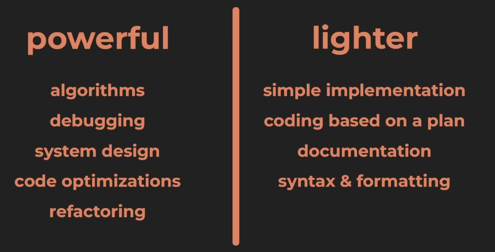

> /init creates - claude.md
> /clear - clear conversation history/context
> /compact<message> - summarize chats before they get long(50% context limit)
>> message - sumamrize the last step or summarize code
> /model [model-name] (go to anitrhopic models website) Haiku
> > model selection - start with powerfue model and then switch to lighter model for fine-tuning(Haiku)

## compact and save your work for later.
Managing long sessions in **Claude Code** is a smart move. As a conversation grows, the "context window" (the AI's
memory) fills up, which can make responses slower or more expensive in terms of tokens.

Here is how you can effectively compact and save your work for later.

---

### 1. Using the `/compact` Command

The primary way to slim down a conversation without losing the "plot" is the `/compact` command.

* **What it does:** Claude will summarize the key points, decisions, and code changes made so far.
* **The Result:** It clears the detailed message history and replaces it with that summary. This keeps the relevant
  context alive while freeing up thousands of tokens.
* **How to use it:** Simply type `/compact` in your Claude Code terminal.

### 2. Saving the Conversation for Later

Claude Code automatically saves your session history, but if you want to manually preserve it or move it, here are your
options:

#### A. The History File

Claude Code stores your chat history locally on your machine. You can usually find these logs here:

* **Path:** `~/.claude/history` (on macOS/Linux)

You can open these JSON files in any text editor to review past interactions or back them up.

#### B. Exporting to a File

If you want to save the current state of a conversation into a readable document (like a Markdown file), you can use a
standard shell redirect when you finish a session:

1. While in the terminal, you can highlight and copy the text.
2. Alternatively, if you want to log a session from the start, you can run Claude Code and pipe the output (though this
   makes the interactive UI a bit messy).

### 3. Creating "Snapshots"

If you are working on a specific feature and want to "save" that state to resume later in a fresh window:

1. Run `/compact`.
2. Copy the summary Claude provides.
3. Paste that summary into a file named `CLAUDE_CONTEXT.md` in your project root.
4. In your next session, you can tell Claude: *"Read CLAUDE_CONTEXT.md to see where we left off."*

---

### Summary Table

| Goal                    | Command/Action                |
|-------------------------|-------------------------------|
| **Reduce Token Usage**  | `/compact`                    |
| **View Past Chats**     | Check `~/.claude/history`     |
| **Reset Everything**    | `/clear`                      |
| **Exit and Save State** | `/exit` (Saves automatically) |

**Links**

- https://www.youtube.com/watch?v=eMZmDH3T2bY
- curl -fsSL https://claude.ai/install.sh | bash
- https://clau.de/kevinstratvert
- https://www.youtube.com/redirect?event=comments&redir_token=QUFFLUhqbGdjd2N2b2lSSzI3d2NNcU9YQmhkNWZpZDBNd3xBQ3Jtc0tua0VqYUhVcWVNVENhNXRVb1JtN2h6T19WbEpSS0dna2pMWVl3OTY3VkJ6NXZaNzhrTG5GQ2MtRTJaRnJHZ2lwWkpYTkJRR1M1NmlhM1NoUHlVd3M2WXJHSUpkdWFkVjVZUkZkSnRwV1lERDR5RWhzYw&q=https%3A%2F%2Fdrive.google.com%2Fdrive%2Ffolders%2F1ZFRZcOCfepQlupySUj_2D3xQzjjpHxND%3Fusp%3Ddrive_link
- humanlayer.dev
- https://www.humanlayer.dev/#learn-more
- https://tylerburnam.medium.com/how-i-use-claude-code-c73e5bfcc309
- https://github.com/hesreallyhim/awesome-claude-code
- https://github.com/skills-directory/skill-codex
- **Optimize token usage** https://www.youtube.com/watch?v=EssztxE9P28
- https://code.claude.com/docs/en/how-claude-code-works

