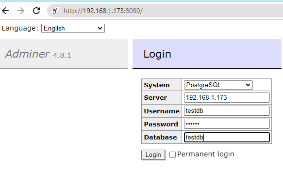

# Database Servers

Docker compose will run all needed development databases locally. 
A `docker-compose.yml` file has been provided. To startup the containerized local development environment, run:

> **Pre-requisite**:
>> You should have docker installed. If you are like me and using windows as your development enviroment
>> use this [link](https://docs.docker.com/desktop/windows/install/) to install docker desktop
>>> Using docker command  *'docker compose up'* to deploy multiple containers defined in docker-compose.yml
> 
> Containers defined in mongodb are :
>> mongodb_mongo - the mongo db instance, mongodb_mongo-express - the mongo client ui  
> 
> Docker containers to be started - mongodb_mongo and mongodb_mongo-express
> 
> > 
> Containers defined in postgresql are :
>> postgresql_postgres - the postgresql db instance, postgresql_postgres - the postgresql client ui  
> 
> Docker containers to be started - postgresql_postgres and postgresql_admin


> What is docker compose
>> Compose is a tool for defining and running multi-container Docker applications. With Compose, you use a YAML file
> to configure your application’s services. Then, with a single command, you create and start all the services from your configuration 

> Using sql driver psycopg2 and pymongo
>> pip install psycopg2
> 
>>  pip install pymongo

- cd src/database

## mongodb
- creates mongodb container
```
cd ./mongodb
docker compose up
Above creates a containerized instance of mongodb, creates teachers collection and adds data to this collection
```

### Connection Information
Here is connection information for the MongoDB data store:

```
username: testdb    
password: testdb    
database: testdb 
``` 

MongoDB collection: `teachers`
MongoDB GUI: http://localhost:8081

## postgresql
- creates a postgresql container
- cd src/database
```
cd ./postgresql
docker compose up
Above creates a containerized instance of postgresql database, creates students table and adds data to this table.
```

### Connection Information
Here is connection information for the PostgreSQL data store:

```
username: testdb    
password: testdb    
database: testdb 
``` 
PostgreSQL table: `students`
PostgreSQL GUI: http://localhost:8080  (make sure you put `postgres` as the server)


### Postgresql Browser Client


### Note: 
When writing code to connect to a data store, you should instead use **`localhost`** as the hostname.


#### stop/remove/deploy,start from command line
# to stop if the container is already running
- docker compose stop
# cleanup -delete the container  
- docker compose down
# deploy,start  
- docker compose up -d
- other commands
  - docker network ls  
  - docker inspect postgres


# reference
- https://medium.com/@etiennerouzeaud/play-databases-with-adminer-and-docker-53dc7789f35f