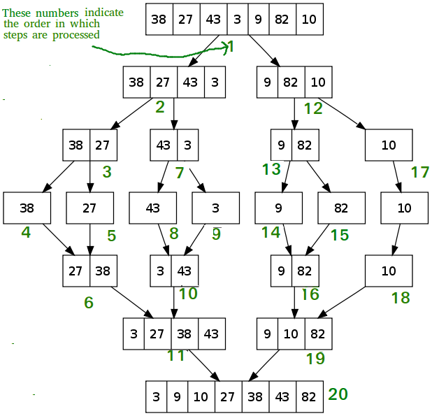

<pre>
Insertsort the following:
61,109,149,111,34,2,24,119,122,125,27,145
</pre>

# Insertsort
To sort an array of size n in ascending order: 
- Iterate from arr[1] to arr[n] over the array. 
- Compare the current element (key) to its predecessor. 
- If the key element is smaller than its predecessor, compare it to the elements before. 
   Move the greater elements one position up to make space for the swapped element.
- 
- [ref](https://www.geeksforgeeks.org/insertion-sort/)

# MergeSort
- divide  elements to leaf nodes
  
- then merge leaf nodes back
  
- [ref](https://www.interviewbit.com/tutorial/merge-sort-algorithm/)